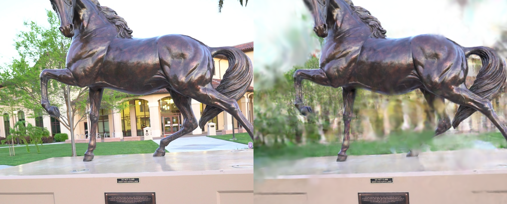
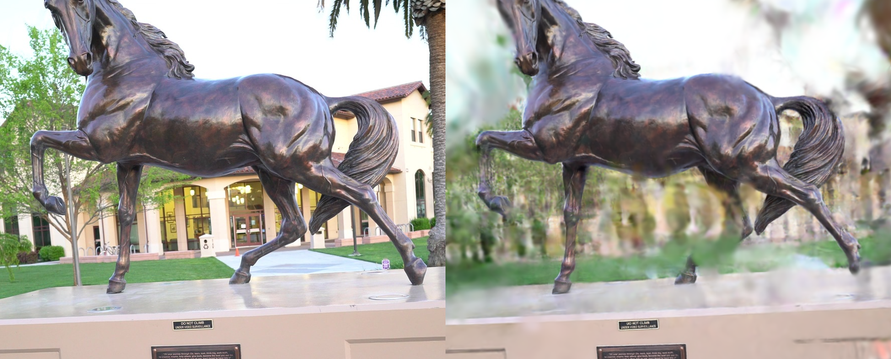

# Custom 3D Gaussian Splatting (CUDA)

C++/CUDA 3D Gaussian Splatting engine: COLMAP reconstruction, anisotropic Gaussian optimization, and a pybind11 rasterizer. Forward and backward kernels project covariances with GLM, shade spherical harmonics, and α-blend depth-sorted 16×16 tiles; `scripts/train.py` optimizes with L1+D-SSIM and writes Inria `point_cloud.ply`.

## Architecture

```
 images/
    │
    ▼
 COLMAP  (feature_extractor → exhaustive_matcher → mapper → image_undistorter)
    │
    │  undistorted/sparse + undistorted/images
    ▼
 DataLoader                         gaussian_splatting/utils/dataloader.py
    │  parse cameras, seed μ from the point cloud
    ▼
 Python trainer                     scripts/train.py
    │  L1+D-SSIM, Adam, densify / prune
    ▼
 pybind11 C++ extension             csrc/bindings.cpp  →  custom_rasterizer_cuda
    │
    ├── project     GLM quaternions, world→camera covariance, 2D means
    ├── SH          view-dependent color from albedo + illumination coeffs
    └── rasterize   16×16 tile binning, CUB radix sort, front-to-back α-blend
            │
            ▼
       rendered RGB  ──backward──►  projection / SH / blend grads
            │
            ▼
       checkpoints (.pt)  and  point_cloud.ply
```

## Results





Horse scene, 151 views, RTX 2060 Super (8 GB). Full-frame scores are limited by densify budget / background coverage on 8 GB VRAM; center-crop scores isolate the subject under the same constraint.

```
[eval] full  | Views: 151 | L1: 0.266530 | PSNR: 10.336 dB | SSIM: 0.470
[eval] crop  | Views: 151 | L1: 0.143482 | PSNR: 14.629 dB | SSIM: 0.581 (center 50%)
```

```
[bench] Device: NVIDIA GeForce RTX 2060 SUPER | Gaussians: 100000 | warmup: 100 | iters: 100
resolution        forward_ms   backward_ms       fps
1280x720               8.747        71.124     114.3
1920x1080             17.724       154.640      56.4
```

## Build

Single NVIDIA GPU. PyTorch ≥ 2.0 CUDA wheel matches the toolkit (`cu118` / 11.8 or `cu124` / 12.4). Linux: `g++` + `nvcc`. Windows: `cl.exe` + `nvcc`. `colmap` on `PATH`. Python 3.10–3.12.

```bash
python -m venv .venv
source .venv/bin/activate   # Windows: .venv\Scripts\activate

# Linux
sudo apt install libglm-dev
# Windows (headers in <env>/Library/include)
conda install -c conda-forge glm
# optional vendor, either OS: third_party/glm/glm/glm.hpp
git clone --depth 1 https://github.com/g-truc/glm.git third_party/glm

pip install torch --index-url https://download.pytorch.org/whl/cu124
pip install -r requirements.txt
pip install -e .
python -c "import custom_rasterizer_cuda as m; print(m.project, m.rasterize)"
```

GLM search order: `third_party/glm`, then `<env>/Library/include` (Windows conda), then `<env>/include`. `/usr/include` from `libglm-dev` needs no extra path.

## Run

```
Horse/
  IMG_0001.jpg
Horse_colmap/
  undistorted/sparse/     # cameras.bin, images.bin, points3D.bin
  undistorted/images/
```

```bash
python scripts/train.py -d Horse -e 100 -o output -c 5 -cp checkpoints

python scripts/train.py -d Horse --colmap-workspace Horse_colmap -e 100 -o output -c 5 -cp checkpoints

python scripts/eval.py -d Horse --checkpoint output/gaussians_final.pt --colmap-workspace Horse_colmap

python scripts/run.py -d Horse --render-only -o output/renders --max-views 8

python scripts/run.py -d Horse --export-only -o output/renders
# output/renders/point_cloud.ply

python scripts/bench.py
# 1280x720 and 1920x1080: forward ms, backward ms, FPS
```
